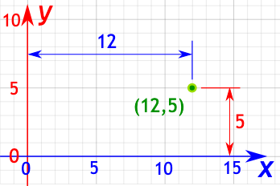
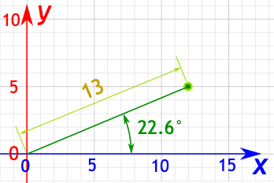

# Challenge 1: Multi-Line Chart with Cross Lines

## Overview

Build a multi-line time series chart showing annual CO2 emissions per capita over time for multiple countries. This challenge introduces the fundamentals of AG Charts including series configuration, axes setup, and annotation features.

## Learning Objectives

- Configure basic chart options in AG Charts
- Create multiple line series in a single chart
- Add axes with custom formatters
- Use cross lines to annotate important events and averages

## Chart Type

**Line Chart** with multiple series (one per country)

## What You'll Build

A line chart displaying CO2 emissions data with:

- Multiple line series (one per country)
- Custom axis labels with formatting
- Horizontal cross line showing the average emissions
- Vertical cross lines and ranges marking historical events (WW1, WW2)

## Key Concepts

### 1. Chart Options Structure

AG Charts uses a declarative options object, where each property controls a different feature withing the chart.

For example, to add a title to the chart, simply add the title property:

```typescript
const chartOptions: AgChartOptions = {
  title: { text: 'Chart Title' },
};
```

The `AgChartOptions` object controls everything within the chart, from series' and axes', to themes and events.

### 2. Providing Data

All charts require a data source, which can be provided as either a callback or as raw data to the `chartOptions.data` property:

```typescript
const chartOptions: AgChartOptions = {
  data: getData(),
};
```

Once the data has been provided to the chart, we can start to access it from other properties to define our chart configuration.

### 2. Series Configuration

#### 2.1 Cartesian vs. Polar

There are two main systems for plotting charts: Cartesian Coordinates, and Polar Coordinates.

Cartesian Coordinates use the x/y axes, and plot points based on how far along (x axis) and far up (y axis) a point is. This includes things like lines, bars, and bubble charts.



Polar Coordinates use a radius axis, and plot points based on how far away, and what angle they are. This includes things like Pie, Donut and Radar charts.



We'll cover both types of charts in this workshop, however, this first exercise focuses on Cartesian charts, more specifically a line chart.

#### 2.2 Defining a Series

In AG Charts, all series types, e.g. line, bar, area, etc... are defined within the `chartOptions.series` property. The `series` property accepts an array of objects, where each object represents a series within the chart, which means we can have multiple series' types in a single chart.

Each Cartesian Series' object requires:

- `type`: Chart type (e.g., `'line'`, `'bar'`, `'area'`)
- `data`: Array of data points
- `xKey`: Property name for x-axis values
- `yKey`: Property name for y-axis values

For example, to create a simple line chart that shows the temperature by each month, we set the following values:

```typescript
series: [
  {
    type: 'line',
    xKey: 'month',
    yKey: 'temperature',
  },
];
```

In this example, `month` and `temperature` are keys that exist within the dataset provided in the previous step. For this challenge, you'll need to refer to the `./data.ts` file to understand the data structure, and use the relevant keys to create the line series'.

You can also provide additional properties to the series object to control specific features of that series. For example:

```typescript
series: [
  {
    ...
    yName: 'Temp (c)'
    marker: {
      enabled: false
    },
  },
];
```

The `yName` property controls the string that is displayed to the user for the Y axis, and the `marker` property is used to control the marker the is displayed within the line chart; in this case, we're just disabling it.

[Learn more about the different Line Series options available in our documentation.](https://www.ag-grid.com/charts/react/line-series/)

### 3. Axes Configuration

Once the Series' have been configured, we can begin configuring and formatting the Axes.

All axes configurations are controlled within the `axes` property:

```typescript
axes: [
  {
    type: 'number', // 'number', 'category', 'time', etc.
    position: 'left', // 'left', 'right', 'top', 'bottom'
  },
  {
    type: 'category',
    position: 'bottom',
  },
];
```

Each axes contains:

- `type`: [Type of axis](https://www.ag-grid.com/charts/react/axes-types/), e.g. number, time, category, or log
- `position`: [The position of this axis](https://www.ag-grid.com/charts/react/axes-position/), e.g. top, left, bottom, right

These are the only two required properties, however, there are a range of customisations we can apply. For example:

```typescript
axes: [
  {
    ...
    label: {
      formatter: (params) => `£${params.value.toFixed(0)}`,
    },
  },
];
```

In this example, we're using a callback function to dynamically format the label; in this case, rounding to 2 decimal places, and adding a currency symbol.

### 4. Cross Lines

Amongst lots of other axes features, we can also add cross lines, which are static lines displayed over the chart data, typically to indicate some sort of event.

There are different types of crosslines, including lines, and ranges, which can be applied both vertically and horizontally:

**Horizontal/Vertical Line:**

```typescript
crossLines: [
  {
    type: 'line',
    value: 2009, // The x or y value
    label: {
      text: 'GFC',
      position: 'top',
      fontSize: 14,
    },
    lineDash: [4, 4], // Dashed line pattern
  },
];
```

**Range (Shaded Area):**

```typescript
{
  type: 'range',
  range: [1914, 1918],     // Start and end values
  label: {
    text: 'WW1',
    position: 'top',
    fontSize: 14
  }
}
```

## Data Structure

The data is provided in `data.ts`:

```typescript
// Array of country data objects
const data = [
  {
    country: 'Canada',
    data: [
      { year: 1800, annualCO2EmissionsPerCapita: 0.0 },
      { year: 1801, annualCO2EmissionsPerCapita: 0.0 },
      // ... more years
    ],
  },
  // ... more countries
];

// Pre-calculated average
const averageEmissionsSince1800 = 4.56;
```

## Implementation Steps

1. **Import Required Types**

   - Import `AgChartOptions` and `AgLineSeriesOptions` from `'ag-charts-community'`

2. **Configure Title and Subtitle**

   - Set appropriate title and subtitle text

3. **Map Data to Series**

   - Transform the `data` array into series configurations
   - Each country becomes a separate line series
   - Use `map()` to create series from country data

4. **Configure Left Axis (Y-axis)**

   - Set type to `'number'`
   - Position on the `'left'`
   - Add a formatter to display values with units (e.g., "10 t")
   - Add a horizontal cross line at `averageEmissionsSince1800`

5. **Configure Bottom Axis (X-axis)**
   - Set type to `'category'`
   - Position on the `'bottom'`
   - Add range cross lines for WW1 (1914-1918) and WW2 (1939-1945)
   - Add a vertical line cross line for GFC (2009)

## Documentation References

- [AG Charts Line Series](https://charts.ag-grid.com/react/line-series/)
- [AG Charts Axes](https://charts.ag-grid.com/react/axes/)
- [AG Charts Cross Lines](https://charts.ag-grid.com/react/axes-cross-lines/)
- [AG Charts Options Reference](https://charts.ag-grid.com/react/api/options/)

## Success Criteria

Your chart should display:

- Multiple colored lines (one per country)
- Y-axis labels with "t" suffix (tonnes)
- Horizontal dashed line showing average emissions
- Shaded ranges for WW1 and WW2
- Vertical line marking the GFC in 2009
- Interactive legend showing all countries
- Tooltips on hover showing exact values

## Tips

- Start with a basic chart and add features incrementally
- Use the browser console to debug any TypeScript errors
- Cross lines are added to the axis configuration, not the series
- The `lineDash` property uses an array pattern: `[dashLength, gapLength]`
- Test your chart by hovering over lines to see tooltips

## Code Snippets

### Creating Series from Data

```typescript
series: data.map((countryData) => ({
  data: countryData.data as ICountryData[],
  type: 'line',
  xKey: 'year',
  yKey: 'annualCO2EmissionsPerCapita',
  yName: countryData.country,
  marker: {
    enabled: false,
  },
})) as AgLineSeriesOptions[];
```

### Axes Formats and Crosslines

```typescript
axes: [
  {
    type: 'number',
    position: 'left',
    label: {
      formatter: (params) => `${params.value.toFixed(0)} t`,
    },
    crossLines: [
      {
        type: 'line',
        value: averageEmissionsSince1800,
        label: {
          text: `Avg: ${averageEmissionsSince1800.toFixed(2)} t`,
          position: 'top-left',
        },
        lineDash: [4, 4],
      },
    ],
  },
  {
    type: 'category',
    position: 'bottom',
    crossLines: [
      {
        type: 'range',
        range: [1914, 1918],
        label: {
          text: 'WW1',
          position: 'top',
          fontSize: 14,
        },
      },
      {
        type: 'range',
        range: [1939, 1945],
        label: {
          text: 'WW2',
          position: 'top',
          fontSize: 14,
        },
      },
    ],
  },
],
```
